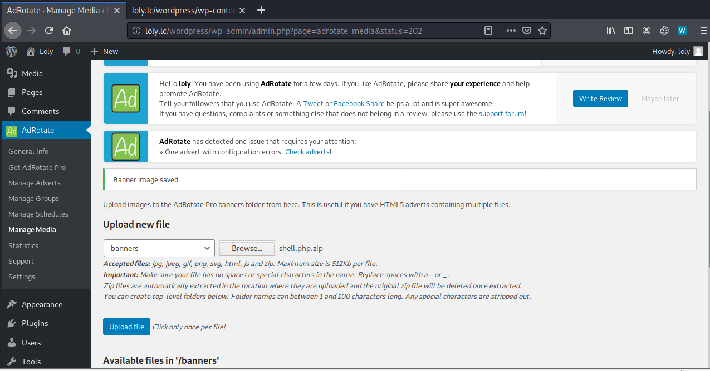
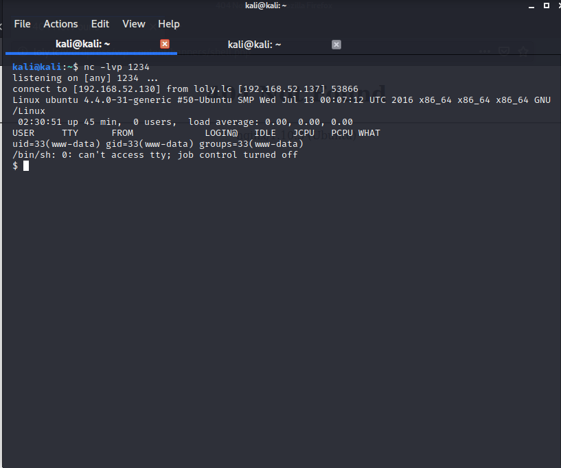
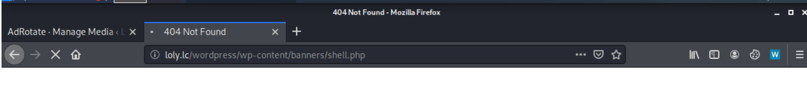
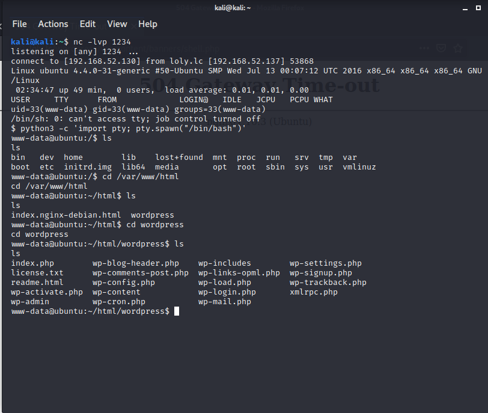
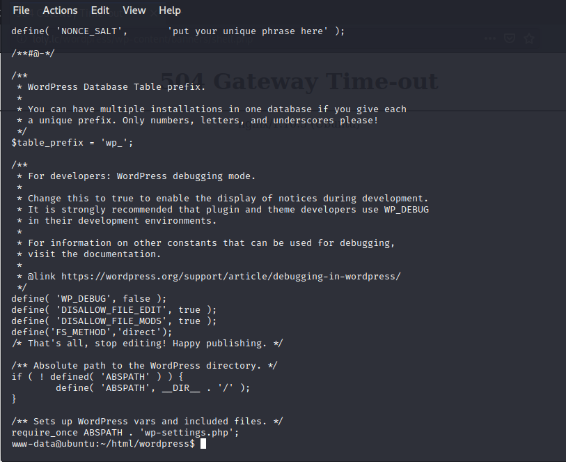
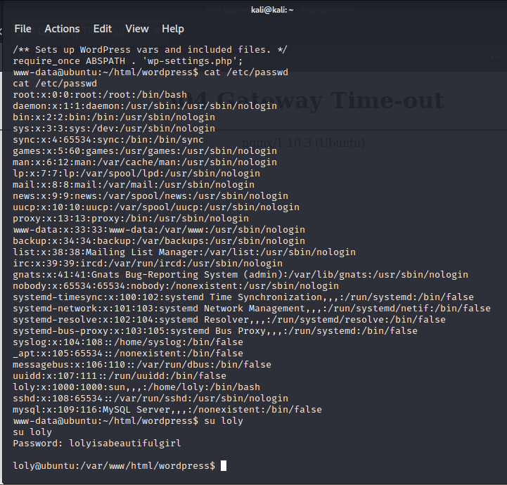
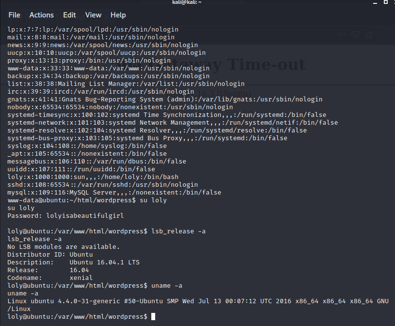
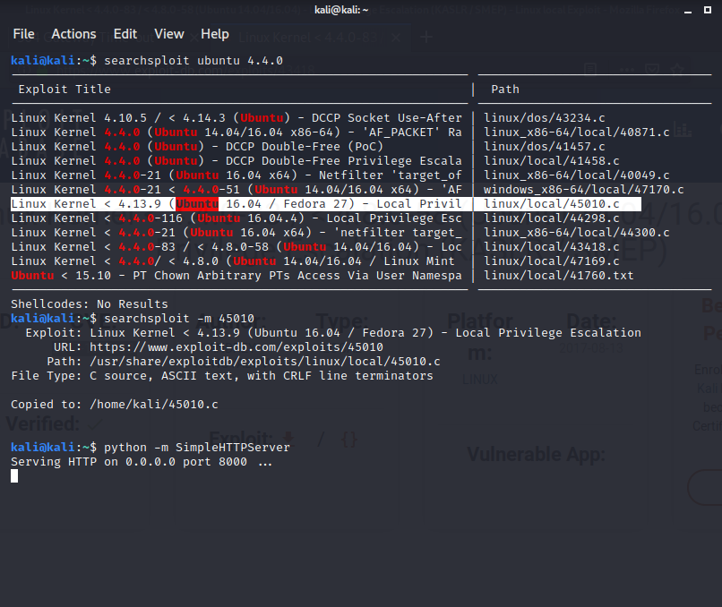
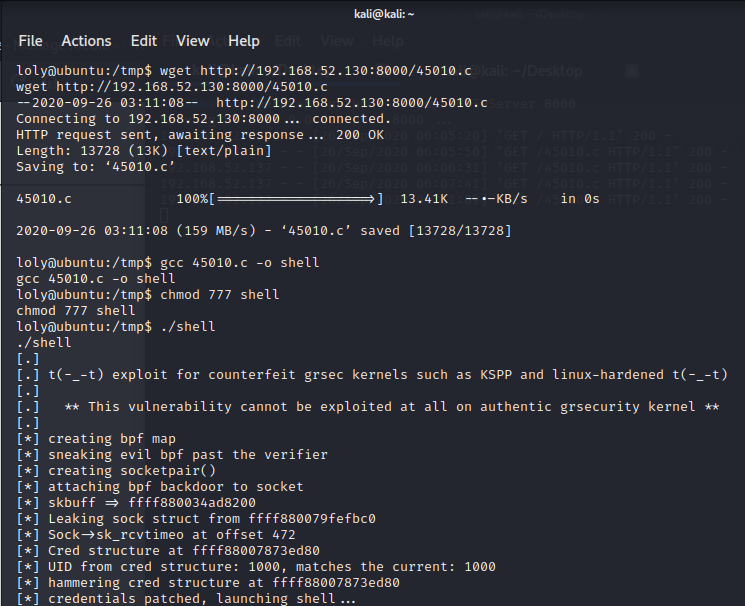
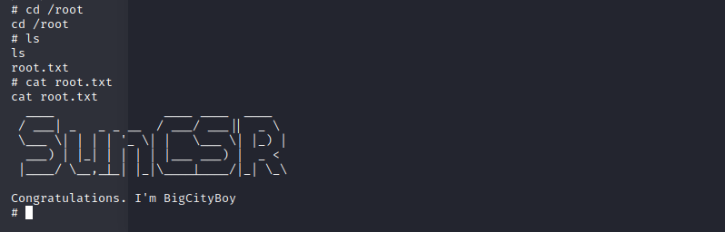

# Loly-1-Vulnhub-Walkthrough
Loly: 1 Vulnhub Walkthrough

**Description**

    Difficulty: Easy
    Tested: VMware Workstation 15.x Pro (This works better with VMware rather than VirtualBox)
    Goal: Get the root shell i.e.(root@localhost:~#) and then obtain flag under /root).
    Information: Your feedback is appreciated - Email: suncsr.challenges@gmail.com

    Name: Loly: 1
    Date release: 21 Aug 2020
    Author: SunCSR Team
    Series: Loly
Click [here](https://vulnhub.com/entry/loly-1,538/) to download the machine!

So let's begin hacking!!

**Step 1: Scan the machine**

> nmap -sV <IP_address_of_your_machine>

From the scan we can see that, port 80 is open. Let's explore port 80.

**Step 2: Go to machine's IP in web browser**

In your web browser

>http://<IP_address_of_your_machine>  

This doesn't help us much! Let's try bruteforcing the IP with dirb.

**Step 3: Bruteforce the IP with dirb**

> dirb http://<IP_address_of_your_machine> 

From the scan we can see that this is a wordpress site.

But the website is not properly responding, may be because of domain name mapping.

Hence, we need to add the entry in /etc/hosts file as shown in the image below. This entry will not only browse the page in an efficient way but will also help us to run wpscan on the next screen.

**Step 4: Run wpscan**

From the scan we get to know the username `loly` , let's bruteforce it with wpscan.

**Step 5: Bruteforce the password**

We successfully got the password for the username. Let's login with the credentials.

**Step 6: Login to wp-login**

**Step 7: Exploiting**

Uploading a php reverse shell but it's in zip format as the admin panel accepts zip format and automatically unzips the file.

**Step 8: Access the shell**

Start listening to the mentioned port and then open the shell in the browser

After getting the shell, trying to get shell from python one-liner to get a clear picture.

From the `wp-config.php` file we got the password `lolyisabeautifulgirl`

Trying to get to know whom this password belongs to.

Looks like it belongs to `loly`.

**Step 9: Privilage escalation**

Login to `loly`.

The lsb_release command displays LSB (Linux Standard Base) information about specific Linux distribution, including version number, release codename, and distributor ID.

Next, we will run the uname command to know about the Linux kernel version and some other information so we should have enough evidence about the system for Privilege Escalation.

Now we know that Ubuntu 4.4.0 is running on the victim's machine. Let's try to find out the exploit related to this version.

There is an exploit related to that version and we can use that.  We have to copy the exploit to the victim's machine for that we are using the python simple http server.

In the reverse shell we obtained, we'll download the exploit file and compile it and we will use the `chmod` command to make the file readable, writable, and executable.

Move into the root folder and reveal the flag!!

