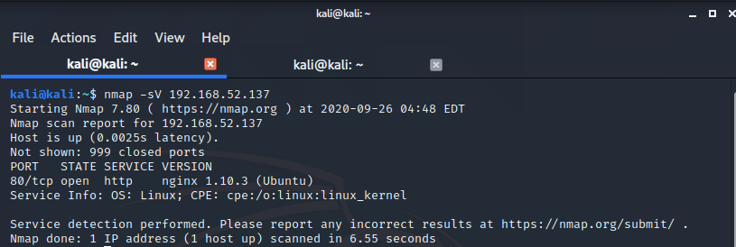
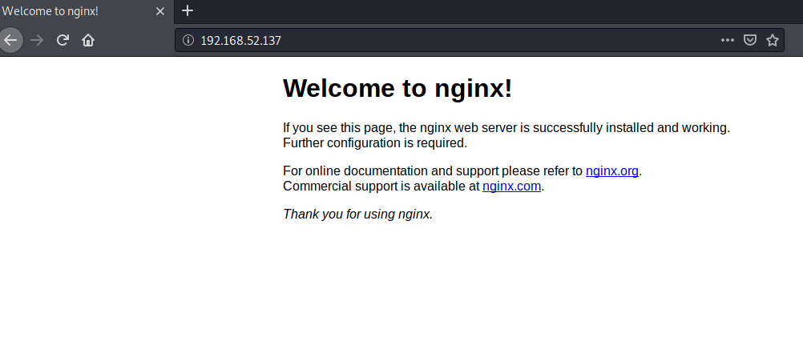
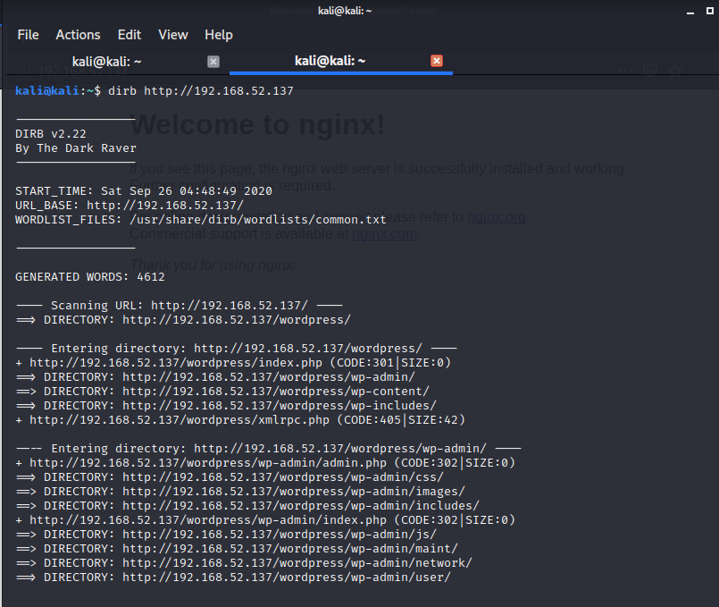
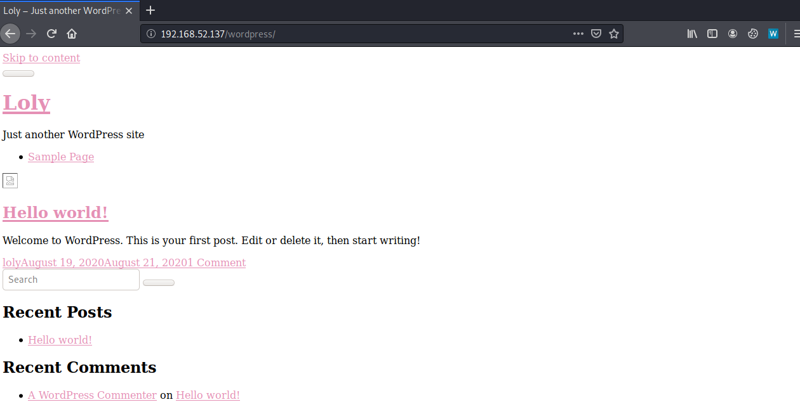
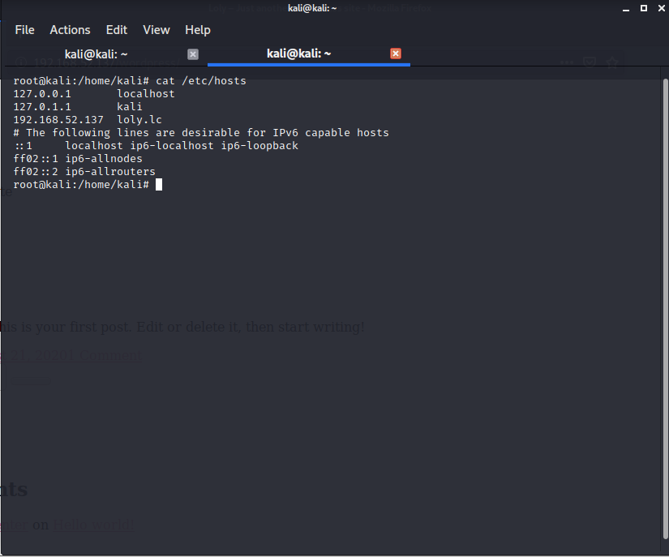
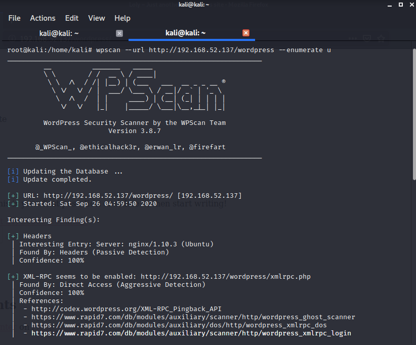
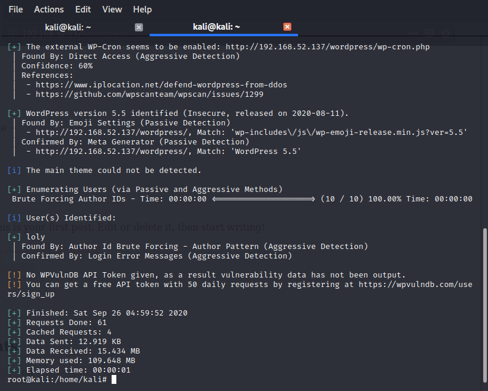
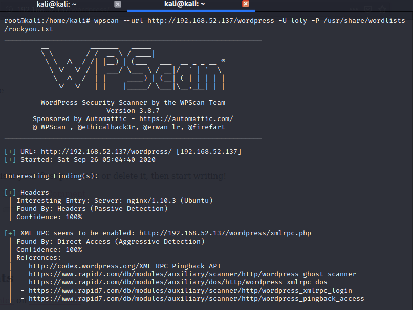
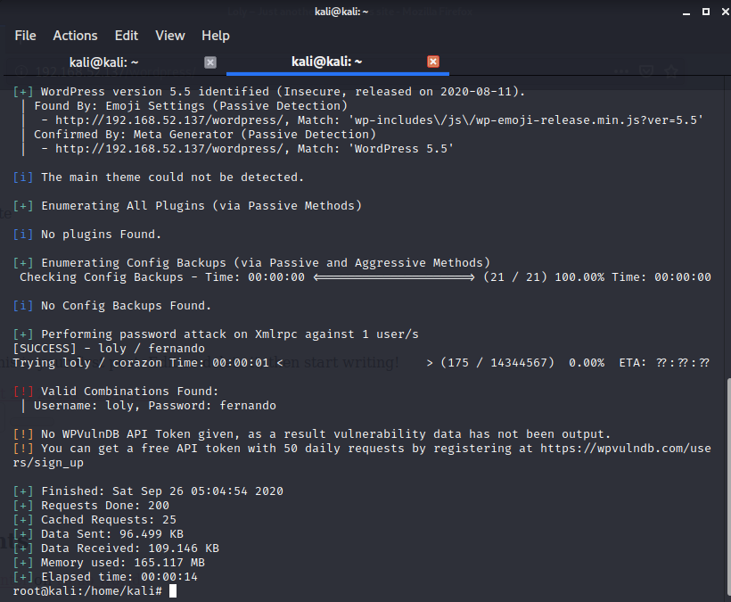
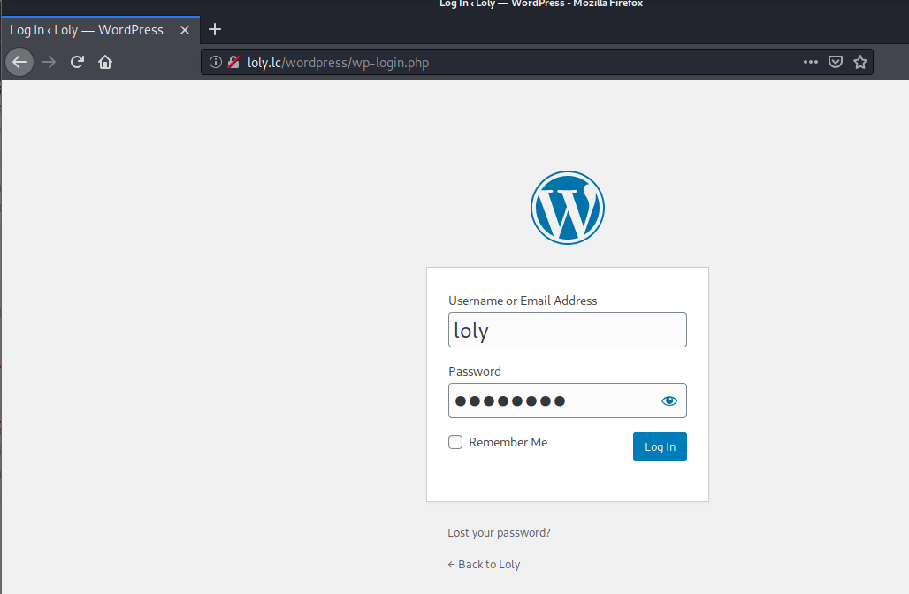

# Loly-1-Vulnhub-Walkthrough
Loly: 1 Vulnhub Walkthrough

**Description**

    Difficulty: Easy
    Tested: VMware Workstation 15.x Pro (This works better with VMware rather than VirtualBox)
    Goal: Get the root shell i.e.(root@localhost:~#) and then obtain flag under /root).
    Information: Your feedback is appreciated - Email: suncsr.challenges@gmail.com

    Name: Loly: 1
    Date release: 21 Aug 2020
    Author: SunCSR Team
    Series: Loly
Click [here](https://vulnhub.com/entry/loly-1,538/) to download the machine!

So let's begin hacking!!

**Step 1: Scan the machine**

> nmap -sV <IP_address_of_your_machine>

From the scan we can see that, port 80 is open. Let's explore port 80.

**Step 2: Go to machine's IP in web browser**

In your web browser

>http://<IP_address_of_your_machine>  

This doesn't help us much! Let's try bruteforcing the IP with dirb.

**Step 3: Bruteforce the IP with dirb**

> dirb http://<IP_address_of_your_machine> 

From the scan we can see that this is a wordpress site.

But the website is not properly responding, may be because of domain name mapping.

Hence, we need to add the entry in /etc/hosts file as shown in the image below. This entry will not only browse the page in an efficient way but will also help us to run wpscan on the next screen.

**Step 4: Run wpscan**

From the scan we get to know the username `loly` , let's bruteforce it with wpscan.

**Step 5: Bruteforce the password**

We successfully got the password for the username. Let's login with the credentials.

**Step 6: Login to wp-admin**

